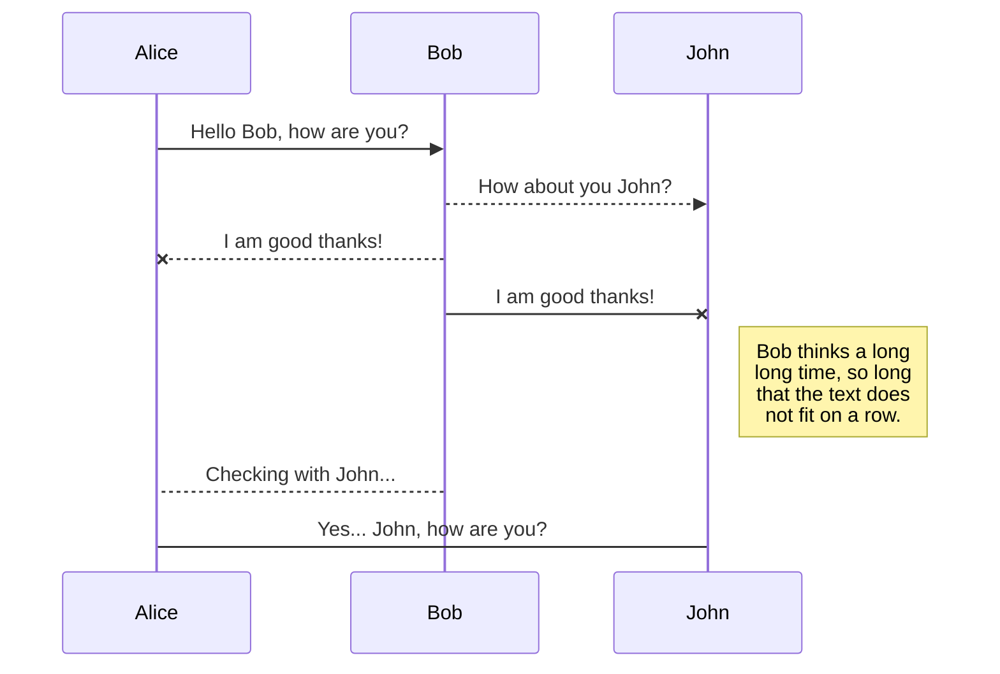
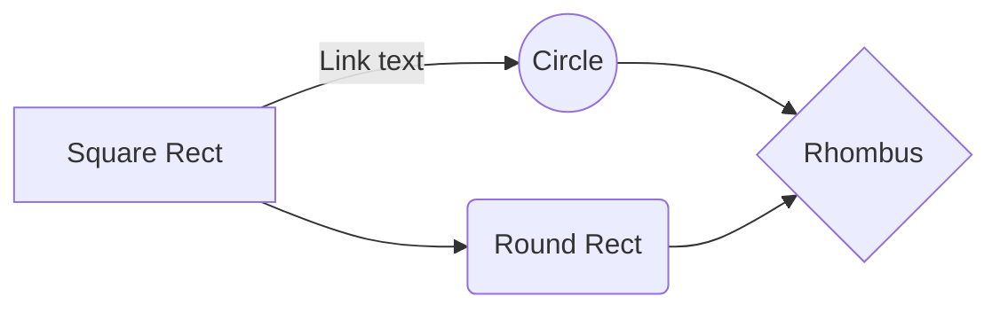

# IBM ENVIZI Training By Agile

## Envizi

Envizi adalah aplikasi pengelola dan analisa terhadap data **ESG** (Envitonmental, Social an Govermence) atau Tata Kelola Sosial dan Perusahaan yang dikembangkan oleh IBM. 
IBM Envizi ESG Suite mengkonsolidasikan data ESG perusahaan untuk analisa dan pelaporan.  IBM Envizi mampu menghlangkan tantangan dan kerumitan pengumpulan, analisis, dan pelaporan data ESG sehingga Anda dapar memanfaatkan kekuatan data tersebut

## ASRI
ASRI atau Agile Suistanability Report and Information adalah produk yang dikembangkan 

## AGILE
PT Anagile Kharisma Utama atau dikenal dengan Agile, merupakan BP (Business Partner) IBM 

## SmartyPants

SmartyPants converts ASCII punctuation characters into "smart" typographic punctuation HTML entities. For example:

|                |ASCII                          |HTML                         |
|----------------|-------------------------------|-----------------------------|
|Single backticks|`'Isn't this fun?'`            |'Isn't this fun?'            |
|Quotes          |`"Isn't this fun?"`            |"Isn't this fun?"            |
|Dashes          |`-- is en-dash, --- is em-dash`|-- is en-dash, --- is em-dash|

## KaTeX

You can render LaTeX mathematical expressions using [KaTeX](https://khan.github.io/KaTeX/):

The *Gamma function* satisfying $\Gamma(n) = (n-1)!\quad\forall n\in\mathbb N$ is via the Euler integral

$$
\Gamma(z) = \int_0^\infty t^{z-1}e^{-t}dt\,.
$$

> You can find more information about **LaTeX** mathematical expressions [here](http://meta.math.stackexchange.com/questions/5020/mathjax-basic-tutorial-and-quick-reference).

## UML diagrams

You can render UML diagrams using [Mermaid](https://mermaidjs.github.io/). For example, this will produce a sequence diagram:

And this will produce a flow chart:

<!--stackedit_data:
eyJoaXN0b3J5IjpbLTc1MDUwMjA2NSwtNDQ0MDkxODg2XX0=
-->enter code here
<!--stackedit_data:
eyJoaXN0b3J5IjpbLTExNjgyODU1MzYsMTMyMTU2MDA4Ml19
-->